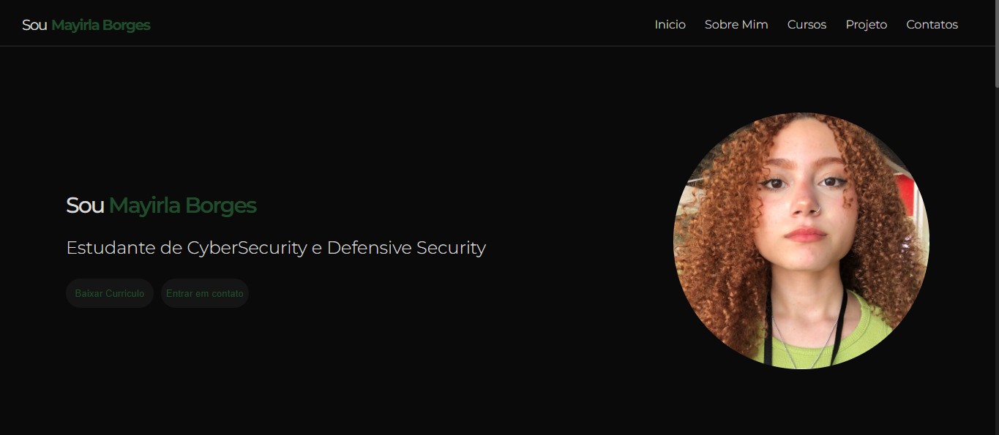
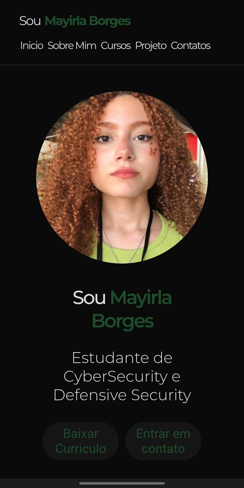

# 🌟 Portfólio Mayirla 

**Link do site:** [https://mayirlaportfolio.vercel.app/](https://mayirlaportfolio.vercel.app/)

Um portfólio elegante e responsivo desenvolvido para apresentar o trabalho profissional de Mayirla. O design limpo e moderno destaca suas habilidades e projetos de forma visualmente atraente.

## 🛠 Tecnologias Utilizadas
- **HTML5** - Estrutura semântica do conteúdo
- **CSS3** - Estilização avançada com:
  - Flexbox para layout
  - Media Queries para responsividade completa
  - Efeitos de hover e transições suaves
- **Vercel** - Hospedagem e deploy contínuo

## ✨ Funcionalidades Principais
- Design 100% responsivo (desktop, tablet e mobile)
- Seção "Sobre" com perfil profissional
- Galeria de projetos
- Efeitos visuais interativos
- Navegação intuitiva

## 📸 Preview - Pc

## 📸 Preview - Mobile

  

